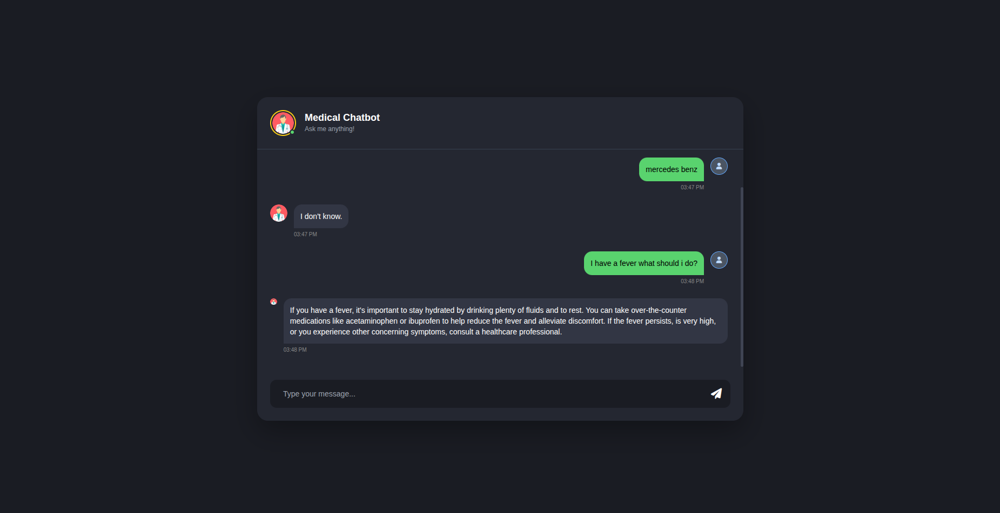

# Medical-Chatbot

On that project it was my first trial to make Medical Chatbot using langachain and ChatOpenAI.
I used The Gale Encyclopedia of Medicine as the primary data source. To ensure the chatbot provided accurate information,
I implemented a preprocessing pipeline before storing the data in Pinecone:
    - Data Extraction: Extracted the raw text content from the encyclopedia.
    - Text Splitting: Segmented the text into chunks of 500 characters with a 
        20-character overlap to maintain contextual continuity.
    - Embedding Generation: Transformed these chunks into vector embeddings using 
    a pre-trained model from Hugging Face.
    - Vector Storage: Indexed the embeddings in Pinecone for efficient similarity searches.
    - Query Logic: Integrated the system with OpenAI's models to generate concise, context-aware medical answers.":
    
    - I gave the system prompt which was - > 
    system_prompt = (
    'You are an Medical assistant for question-answering tasks.'
    'Use the following pieces of retrieved context to answer'
    'the question. If you don "t now the answer, say that you'
    "don 't know. Use three sentences maximum and keep the"
    "answer concise"
    "\n\n"
    "{context}"
) 

# Sample of Chatbot-image
